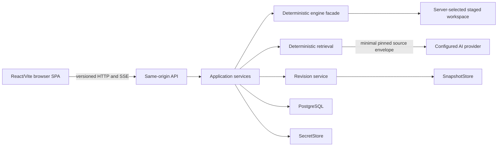

# ADR-004: Hosted engine and API boundary

## Status

Accepted.

## Context

The local browser personal pilot adds a browser interface without changing the
authority model of standalone Warden Drydock campaigns. The browser must not
become a second mutation engine, expose implementation details, or let a model
turn generated text directly into canon. The existing CLI and generated
standalone maintenance script must remain independently usable and behaviorally
compatible.

The pilot is a two-service localhost runtime. The `app` service serves a
compiled React/Vite single-page application, a versioned same-origin API,
application services, a deterministic engine facade, and provider adapters.
The `db` service is internal-only PostgreSQL.

## Decision

### Boundary and authority

The browser communicates only with a versioned, same-origin HTTP API. API
contracts use public domain identifiers and never expose SDK objects,
filesystem paths, database identifiers, provider-native events, or deterministic
engine internals.

Application services invoke a typed, in-process deterministic engine facade.
The server selects snapshot and staged-workspace handles; callers cannot supply
arbitrary paths. The facade stages candidate changes and returns structured
results and findings. It never publishes a revision by itself.

The CLI and generated standalone script remain separate consumers of the
deterministic core. Browser development must add parity tests rather than route
CLI calls through HTTP.

### AI and mutation sequence

Deterministic retrieval completes and its source-set digest is persisted before
any provider request. Every provider result begins as `Draft`.

An authoritative mutation can be requested only after the Warden approves the
exact immutable proposal version and displayed diff against its
`base_revision`. Approval authorizes only that proposal version and diff. The
engine applies the exact candidate change to a clone, rebuilds deterministic
artifacts, validates it, and stages the result for snapshot publication.

No public or provider-facing endpoint may expose a generic shell, filesystem,
arbitrary path, SQL, Git, arbitrary HTTP, apply, approve, or promote operation.

### Capability families

The versioned API may expose these domain capabilities:

- Provider configuration, verification, redacted readiness, and consent.
- Campaign creation, listing, and reading.
- Revisions and Atlas records, search, neighborhood graph, backlinks, history,
  and comparison.
- Retrieval and source envelopes; Ask, Check, Generate, generation resume, and
  workflow-only draft-proposal creation.
- Live-session start, observe, takeover, typed capture, end, and grounding.
- Immutable proposal versions; validation, approval, rejection, conflict, and
  explicit correction.
- Operator-only health, backup, restore, and projection rebuild.

### Provider tool allowlist

A provider may only:

1. read a source already present in the source envelope;
2. request a bounded relationship or history read for the pinned revision; or
3. emit one proposal draft for deterministic validation.

The server binds every tool request to the campaign, revision, and source-set
digest. A provider cannot select files, widen retrieval, apply changes, approve
or promote content, or request a different revision. Out-of-allowlist,
malformed, repeated, stale, or unbound calls fail closed and are audited.

### Streaming contract

Before generation begins, the server persists the retrieval result and source
digest. It then creates a generation identifier and returns a source preview.
The application normalizes provider streams into ordered, versioned events:

- `start`
- `delta`
- `tool_request`
- `tool_result`
- `usage`
- `completion`
- `cancel`
- `failure`

Every event has a monotonically increasing sequence number. A disconnect does
not imply cancellation and never authorizes a mutation. The terminal Draft is
persisted. A client resumes from a sequence number or fetches terminal state.
Provider-native events remain behind the adapter boundary. Server-sent events
are the MVP transport, but ordering, replay, and terminal-state semantics are
transport-neutral.

### Future seams

The application defines ports for `SnapshotStore`, `SecretStore`, workflow and
projection repositories, provider adapters, and delivery. These seams preserve
specific future substitutions without pre-building a distributed system:

- local singleton actor to authenticated principal;
- filesystem snapshots to object storage;
- permissioned secret volume to managed secret store;
- local PostgreSQL to managed PostgreSQL; and
- local same-origin delivery to a remote delivery edge.

Remote hosting is not enabled by these seams. It requires a new ADR covering
authentication, tenancy, TLS, abuse controls, and remote operating boundaries.

## Consequences

- Browser behavior remains subordinate to deterministic Drydock operations.
- Provider integration cannot bypass retrieval, review, validation, or canon
  approval.
- API and stream contracts require explicit versioning and compatibility tests.
- The application remains a modular monolith for the pilot, reducing operational
  surfaces while retaining replaceable storage and provider ports.
- Provider interruptions can be resumed without treating transport failure as a
  mutation decision.

## Alternatives considered

- **Generic model tools or agent shell:** rejected because schemas and prompts
  cannot safely constrain arbitrary filesystem, shell, network, or Git access.
- **CLI or subprocess calls per request:** rejected because the hosted boundary
  needs typed in-process results, controlled workspaces, and cancellation and
  idempotency semantics.
- **Direct model mutation:** rejected because AI output is always provisional
  and the Warden must approve the exact authoritative change.
- **Microservices:** rejected because the single-user local pilot has no scaling
  or isolation need that offsets distributed state and operations.
- **Next.js server functions:** rejected because Python application services own
  authority and a second backend would duplicate or proxy the same boundary.

## Recovery and verification

- Contract tests must prove that public identifiers cannot be interpreted as
  arbitrary paths and that forbidden tools are unavailable.
- Parity tests must exercise equivalent deterministic engine operations through
  the hosted facade, CLI, and generated standalone script where applicable.
- Stream tests must cover ordered events, reconnect, terminal fetch, disconnect
  without cancel, and failure without mutation.
- Mutation tests must prove that only the approved proposal version and diff can
  reach staged validation and publication.
- Security tests must reject stale revision bindings, changed source digests,
  repeated tool calls, and provider attempts to widen authority.
