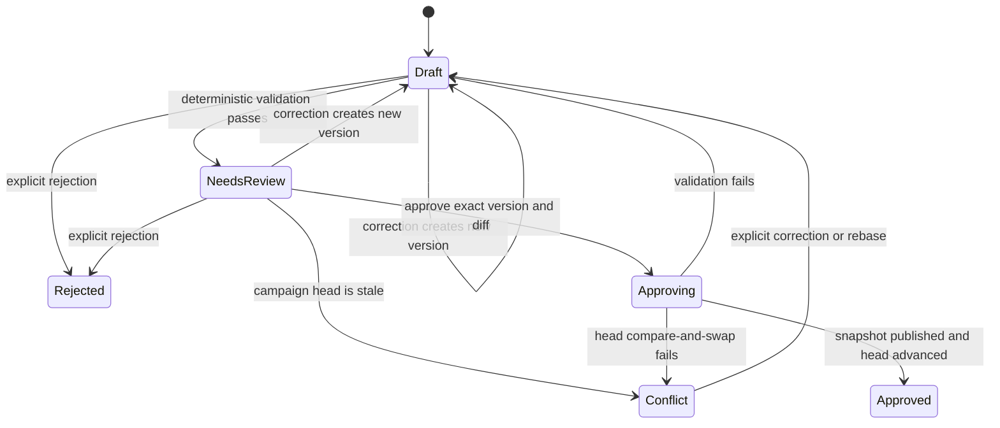

# ADR-005: Hosted snapshot and workflow storage

## Status

Accepted.

## Context

The browser pilot needs immutable campaign revisions, crash-safe approval,
offline table capture, and rebuildable views while preserving standalone
Markdown/frontmatter campaign trees as durable authority. Workflow records and
provider consent are operational state, not campaign content, and must not leak
into snapshots.

## Decision

### Immutable revision envelope

Each approved revision is an immutable, content-addressed full standalone
campaign tree. It preserves Drydock metadata and lock files, adapter assets, the
generated maintenance script, Markdown/frontmatter records, and deterministic
indexes.

Each tree has a versioned sidecar manifest containing:

- manifest version and campaign identifier;
- parent revision and linear ordinal;
- canonical tree digest and sorted file hashes;
- framework and adapter versions;
- validation-contract digest;
- proposal/change digest; and
- publication-intent token.

The sidecar is revision metadata, not campaign content. The canonical envelope
and tree exclude timestamps and mutable labels. Normal operation never rewrites
or deletes a published revision. The MVP history is linear. A fork, missing
parent, ordinal conflict, unsafe path, symlink escape, or hash mismatch fails
closed.

### Campaign creation

Campaign creation follows this sequence:

1. Reserve an idempotency key and request-payload digest in PostgreSQL.
2. Allocate a server-controlled temporary workspace.
3. Run deterministic initialization, indexing, context building, and validation
   in process.
4. On failure, return structured findings and create no campaign head.
5. Canonicalize and hash the standalone tree.
6. Persist a creation publication intent and unique publication-intent token.
7. Publish with `put-if-absent` to the `SnapshotStore`, embedding that token.
8. In one PostgreSQL transaction, register the campaign, revision, head,
   projections, receipt, and audit event.
9. Delete the scratch workspace.

Repeating the same idempotency key and payload returns the original result. The
same key with a different payload digest returns a conflict.

### Proposal lifecycle

Corrections never overwrite a proposal version; they create a new immutable
Draft version.

Approval names an immutable proposal version and diff digest. The application
acquires a per-campaign mutation intent or lease, compares current head to the
proposal `base_revision`, applies the exact diff to a clone, rebuilds and
validates deterministic artifacts, and performs explicit canon transitions.
It persists an approval publication intent, publishes the snapshot with the
intent's unique publication-intent token, and finalizes the new head by
PostgreSQL compare-and-swap exactly once.

If the process crashes before snapshot publication, retry or cancellation is
safe. If it crashes after publication, recovery finalizes the database exactly
once only when the snapshot token matches a persisted creation or approval
publication intent and all expected campaign, parent, ordinal, tree, and change
digests match. A published snapshot without one unambiguous matching intent is
quarantined as an orphan: it cannot become a head, projection source, lineage
parent, or normal read result until explicit operator recovery resolves it. A
stale head produces `Conflict`; the application never silently merges or
rebases.

### PostgreSQL ownership

PostgreSQL stores rebuildable projections derived from snapshots:

- campaign, revision, and head registry;
- record summaries and bodies;
- facets and authority state;
- relationship edges and backlinks;
- approved history;
- deterministic text indexes, counts, provenance, and versions; and
- projection checkpoints and validation summaries.

PostgreSQL also stores non-derived operational state that must be backed up:

- workflow state and audit records;
- redacted provider configuration metadata, verification, and consent;
- live sessions and controller state;
- synchronized unapproved facts and unresolved questions;
- Draft generations and immutable proposals;
- idempotency, approval, synchronization receipts, and jobs; and
- UI preferences.

Provider secrets are stored neither in PostgreSQL nor in snapshots. They live
only in the dedicated `SecretStore`.

### Projection rebuild

Rebuild runs in maintenance/read-only mode. It verifies versioned envelopes,
paths, file hashes, lineage, ordinals, and compatibility before parsing. It
builds shadow projections, compares record counts and digests, and atomically
swaps them into service. Workflow and audit tables are untouched. Corruption
fails the affected campaign closed and never modifies a snapshot.

If PostgreSQL is completely lost, verified snapshots recover campaign content,
unambiguous lineage, Atlas records, graph, and approved history. Head is
reconstructed only from a unique, fully verified linear lineage whose
publication-intent evidence is unambiguous under the recovery policy. An
ambiguous or orphan publication is quarantined and cannot be inferred to be the
authoritative head from ordinal, timestamp, or tree presence alone. Snapshots do
not recover workflows, consent, Drafts, live state, audit, idempotency,
approval, or sync receipts.

### Live-session concurrency

Only one live session may be active per campaign. Start pins a
`base_revision`. Every workflow mutation includes the workflow version and
controller epoch. A second tab observes until the Warden explicitly takes over;
takeover increments the epoch, and stale writers are rejected. Notification of
a newer campaign head does not change live grounding.

### Device synchronization

The durable browser mechanism remains technology-neutral. A device assigns a
stable device/install identifier and operation identifier before showing an
item as **Saved on device**. Each operation contains:

- session and operation type: confirmed fact, unresolved question, or end
  intent;
- device-local order;
- payload digest; and
- base revision.

The uniqueness key is session/device/operation. Exact replay returns the prior
acknowledgement; reuse with a different digest conflicts. Receipts live for the
session and campaign lifetime. Multiple devices use distinct identifiers and an
explicit stable ordering.

An end intent names the exact queue watermark or operation set. Proposal
generation waits until all named captures and the end intent are accepted.
Unresolved questions synchronize but never enter grounding as facts.

### Backup

Backup first warns that unsynchronized browser data is excluded and requires
acknowledgement. It then enters maintenance mode, rejects writes, drains jobs,
reconciles mutation intents, records the schema and snapshot-inventory root,
archives snapshots and manifests, and creates a quiesced PostgreSQL custom dump
with `pg_dump -Fc`. A backup manifest records application, schema, and snapshot
versions plus hashes. Verification checks hashes and `pg_restore --list`.
Periodic drills restore into a disposable environment and rebuild projections
before leaving maintenance mode.

PostgreSQL documents the portability and restore behavior of SQL and custom
dumps in [SQL Dump](https://www.postgresql.org/docs/current/backup-dump.html) and
the [`pg_restore` reference](https://www.postgresql.org/docs/current/app-pgrestore.html)
(checked 2026-08-11).

### Restore

Restore retains the old volumes. It verifies manifest hashes and compatibility,
loads snapshots into a fresh volume, and validates them read-only. It restores
PostgreSQL into a fresh database with exit-on-error and single-transaction
semantics where supported. Recovery mode reconciles intents, runs reviewed
migrations, rebuilds projections, and compares heads and digests. Normal service
resumes only after these checks; old volumes remain until the Warden accepts the
restore.

Secrets are excluded from backup by default. A default restore therefore
returns to the provider setup gate. Consent is invalid if the credential or its
handling identity differs, including adapter version, endpoint, region, storage
mode, or retrieval-policy version.

## Consequences

- Authoritative campaign data remains a portable standalone tree.
- Full snapshots trade storage efficiency for simple verification, recovery,
  and deterministic comparison.
- Workflow recovery requires coordinated PostgreSQL backups; snapshots alone
  intentionally cannot reconstruct consent, audit, Draft, or live state.
- Creation and approval are robust across retries and crashes but require
  publication-intent-token reconciliation and per-campaign serialization.
- Offline capture can be lossless and idempotent without choosing a browser
  persistence technology in this ADR.

## Alternatives considered

- **Mutable working directory as authority:** rejected because partial writes,
  crash recovery, and history verification become ambiguous.
- **PostgreSQL record rows as campaign authority:** rejected because campaigns
  must remain standalone Markdown/frontmatter artifacts.
- **Delta-only snapshots:** rejected for the pilot because restore and integrity
  depend on an unbounded patch chain.
- **Automatic merge or rebase on stale approval:** rejected because approval
  names an exact diff against an exact base.
- **Questions as live grounding:** rejected because unresolved questions are not
  table facts.

## Recovery and verification

- Golden vectors must cover canonicalization, sorted hashes, unsafe paths,
  symlinks, missing parents, forks, and ordinal conflicts.
- Fault injection must cover every creation and approval boundary, including
  crash after snapshot publication but before PostgreSQL finalization.
- Reconciliation tests must finalize a matching publication intent exactly once,
  quarantine missing, conflicting, or multiply matching intents, and forbid
  snapshot-only head inference from ambiguous artifacts.
- Rebuild tests must prove shadow comparison and atomic swap while preserving
  operational tables.
- Device-sync tests must cover exact replay, digest conflict, multiple devices,
  stale epochs, end barriers, and unsynchronized backup warnings.
- A disposable restore drill must verify backup hashes, list the PostgreSQL
  archive, restore fresh volumes, rebuild projections, compare heads/digests,
  and preserve rollback to the old volumes.
