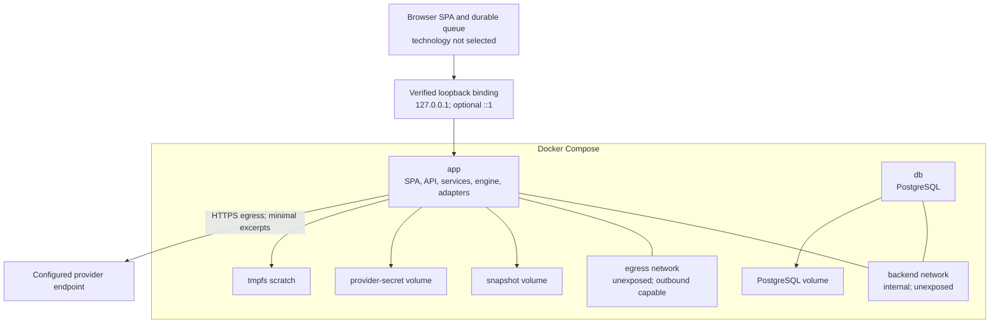

# ADR-006: Local Compose security and operations

## Status

Accepted.

## Context

The personal pilot is operated by one Warden through Docker Compose on
localhost. It still handles provider credentials, unpublished campaign ideas,
and authoritative approval. Local-only deployment reduces but does not remove
network, browser, secret, migration, and recovery risks.

## Decision

### Topology

The runtime contains only `app` and `db`. The previously compiled Vite
application is served by the Python `app`; there is no Nginx, Next.js, Node.js,
Bun, or frontend-development third service. Pinned Node.js LTS and npm tooling
exists only in development, CI, and a disposable image-builder stage using the
committed `package-lock.json` and `npm ci`. That stage is not a runtime service,
and its Node.js, npm, source dependency tree, caches, and build tools are not
copied into the final `app` image.

Only the application port is published, explicitly to `127.0.0.1`. An optional
`[::1]` mapping is enabled only after verification on the supported platform;
otherwise an IPv4-only override is used. Bindings to `0.0.0.0` and `::` are
forbidden. PostgreSQL has no host port. The application and database share an
internal, project-scoped, unexposed `backend` network. A second project-scoped,
unexposed, non-internal `egress` network attaches only to `app` and provides its
outbound provider path. The `db` service never joins `egress`.

Docker Compose warns that omitting a host IP binds a published port to all
interfaces in its [services `ports` reference](https://docs.docker.com/reference/compose-file/services/#ports),
and Docker describes the exposure boundary in
[Port publishing and mapping](https://docs.docker.com/engine/network/port-publishing/)
(checked 2026-08-11). The latter records that releases older than Docker Engine
28.0.0 allowed same-L2 hosts to reach some localhost-published ports. The pilot
therefore defines and tests a maintained minimum Docker version rather than
assuming every localhost mapping is equivalent.

### Threat boundary

The pilot protects against:

- accidental LAN exposure;
- cross-origin requests and DNS-rebinding or forged `Host` headers;
- credentials entering browser state or logs;
- direct host access to PostgreSQL or snapshot services;
- arbitrary provider tools;
- stale, duplicate, or partially completed approval; and
- path traversal, symlink escape, and unsafe rendered content.

It does not protect against a compromised host, browser, Docker daemon, root
account, or disk; existing local malware; provider retention or legal process;
or remote multi-user threats. The local operating-system profile and host
controls define the singleton Warden.

### Application hardening

- Verify exact `Host` and `Origin`; CORS is off by default.
- Use an installation-specific anti-CSRF secret and `SameSite`, `HttpOnly`
  cookies even though the pilot has no accounts.
- Apply a restrictive Content Security Policy.
- Keep provider requests and credentials backend-only.
- Run containers as non-root with a read-only root filesystem, dropped Linux
  capabilities, no Docker socket, bounded resources, and tmpfs scratch.
- Sanitize user content and disable raw HTML rendering.
- Reject traversal, absolute paths, unsafe archive members, and symlink escape.
- Allowlist provider endpoints and redirect destinations; reject endpoint
  widening during a request.
- Log only safe identifiers, stage, timing, token counts, and error codes. Do
  not log credentials, prompts, source excerpts, generated content, raw provider
  events, cookies, or CSRF values.

### Secrets and consent

Provider adapters expose redacted configuration plus an opaque credential. The
credential abstraction supports keys, tokens, and certificates rather than
assuming one vendor's API-key format. Secrets are atomically written to a
permissioned secret volume behind `SecretStore`.

The API may reveal only secret presence, credential-revision fingerprint, and
verification state. Verification does not imply consent. Consent binds:

- provider adapter and version;
- credential revision;
- endpoint, region, and storage mode;
- retrieval-policy version; and
- notice digest.

Changing any bound identity invalidates consent and gates the workspace.
Removing provider configuration also gates the workspace. Removal makes no
secure-erasure promise for copy-on-write filesystems, underlying disks, or old
backups. Secrets are excluded from the default backup.

### Migrations and rollback

Startup takes a migration lock and runs reviewed forward migrations before
readiness. Normal migrations are transactional and backward-compatible for a
defined rollback window. Destructive schema changes require a verified backup
and a separate major-version workflow.

Snapshots are never migrated in place. A content migration creates a new,
reviewed revision. Rolling back an application image is allowed only while the
schema is compatible; otherwise rollback is paired with a fresh restore.

Liveness reports process health. Readiness additionally requires compatible
schema, usable volumes, completed reconciliation, and successful boundary
checks. Provider failure degrades provider-dependent operations but leaves
typed offline/live Capture available.

## Consequences

- The two-service topology minimizes published surfaces and operational parts.
- Localhost remains a real security boundary that is verified across supported
  Docker versions and IP families.
- The pilot uses no account system, but still needs browser request-integrity
  controls.
- Provider removal and restore favor explicit reconfiguration and consent over
  fragile secret portability.
- Schema rollback requires compatibility discipline and verified recovery.

## Alternatives considered

- **PostgreSQL embedded in `app`:** rejected because lifecycle, health,
  persistence, and recovery become coupled and opaque.
- **SQLite:** rejected because the required concurrent workflow, projection,
  migration, dump, and reconciliation semantics are better matched by the
  selected PostgreSQL boundary.
- **Nginx or Next.js third service:** rejected because `app` can serve compiled
  assets and the same-origin API without another runtime or authority layer.
- **Published database port:** rejected because browser and operator workflows
  have no need for direct host database access.
- **Remote deployment now:** rejected because authentication, tenancy, TLS,
  abuse protection, and player/collaboration boundaries are out of scope.

## Recovery and verification

- Compose validation must assert exactly one published service and exact
  loopback host mappings, with no database host port.
- Supported-platform tests must probe IPv4, optional IPv6, LAN isolation,
  minimum Docker version, Host/Origin rejection, CORS, CSRF, and CSP.
- Container inspection must verify non-root execution, read-only root,
  capabilities, missing Docker socket, tmpfs, limits, and volume permissions.
- Secret tests must cover atomic replacement, redacted APIs, log scanning,
  consent invalidation, removal, and setup gating after restore.
- Migration tests must cover lock contention, failed migration readiness,
  backward-compatible image rollback, and destructive-change recovery gates.
- Provider outage tests must show degraded readiness for AI operations while
  Capture remains available.
