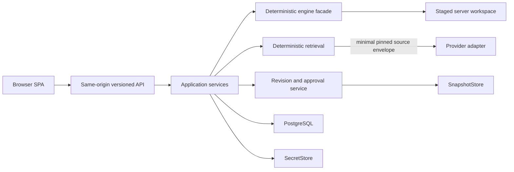
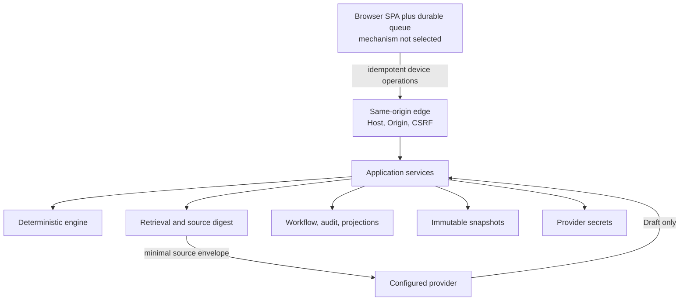

# Local browser personal pilot architecture

## Status and scope

This document is the implementation handoff for the next milestone. ADR-004,
ADR-005, and ADR-006 are **Accepted** and define the binding architecture for
the hosted MVP implementation packages below.

The pilot runs for one Warden on localhost through Docker Compose. It adds a
browser workspace without replacing the released CLI or generated standalone
campaign maintenance script. It excludes provider selection, paid provider
calls, device-persistence technology selection, import/export, remote
deployment, authentication, players, collaboration, embeddings, and executable
or database-schema implementation.

## Recommended architecture

The runtime is a modular monolith plus PostgreSQL:

- `app` serves a previously compiled React/TypeScript/Vite SPA, a versioned
  same-origin HTTP/SSE API, application services, the deterministic engine
  facade, and provider adapters. A builder stage uses pinned supported Node.js
  LTS and npm versions, committed `package-lock.json`, and `npm ci`; the final
  Python image contains no Node.js, npm, Bun, or JavaScript dependency tree.
- `db` is internal-only PostgreSQL for workflow, audit, consent, idempotency,
  and rebuildable projections.
- `SnapshotStore` holds immutable content-addressed full standalone campaign
  trees with versioned sidecar manifests.
- `SecretStore` holds provider credentials separately from PostgreSQL and
  snapshots.

The browser cannot address files or engine workspaces. Provider output is
always Draft. Only approval of an immutable proposal version and displayed diff
against its exact base revision can request an authoritative mutation.

## Trust and data flow

The queue assigns stable device and operation identifiers before displaying
**Saved on device**. The provider receives only the persisted minimal envelope
for a pinned revision and can use only allowlisted, server-bound reads. It
cannot mutate or promote content.

## Capability ownership, authority, and recovery

| Capability | Owner | Authoritative input/output | Recovery behavior |
| --- | --- | --- | --- |
| Setup and consent | Application service + `SecretStore` | Redacted provider metadata, secret fingerprint, consent identity | Missing/different secret or handling identity returns to setup gate |
| Campaign creation | Engine facade + revision service | Deterministic standalone tree becomes immutable revision | Idempotency receipt returns prior result; failed validation creates no head |
| Atlas records | Snapshot projections | Pinned revision Markdown/frontmatter | Rebuild projections from verified snapshots |
| Graph and record list | Snapshot projections | Deterministic edges, backlinks, facets, and text index | Shadow rebuild, digest comparison, atomic swap |
| Timeline | Snapshot projections | Approved revision history; overlays labeled non-canon | Rebuild approved history; workflow overlays need PostgreSQL backup |
| AI Ask/Check/Generate | Retrieval + provider adapter | Persisted source envelope and digest; result is Draft | Resume ordered generation or fetch terminal Draft; never mutate on disconnect |
| Live start | Live service | One active session and pinned `base_revision` | Restore requires workflow backup; newer head never silently re-grounds |
| Live capture | Device sync + live service | Idempotent typed fact/question operation | Replay exact operation; digest mismatch conflicts; stale controller rejected |
| Live end | Live service | End intent naming exact queue barrier | Wait for all named captures and accepted end intent before proposal generation |
| Proposals | Workflow repository | Immutable proposal versions and deterministic validation | Corrections create new Draft; stale head becomes Conflict |
| Approval | Revision service + engine | Exact version/diff against exact base; new snapshot/head | Publication-intent token reconciles crash; head compare-and-swap prevents duplicates |
| Revisions | `SnapshotStore` + revision registry | Immutable content-addressed full tree and sidecar | Verify hashes/lineage; fail corrupt campaign closed |
| Backup/restore | Operator service | Snapshot archive, manifest, PostgreSQL custom dump | Restore fresh volumes, reconcile/rebuild/compare, retain old volumes until accepted |

## Phase 3 contract inventory

Each contract must be versioned, documented, and tested before dependent UI or
provider work begins:

- **API envelope and errors:** request ID, idempotency key, public resource
  identifiers, structured findings, conflict class, safe error details, and
  compatibility version.
- **Engine commands/results/findings:** typed inputs, server handles, staged
  output, deterministic finding codes, no publication authority.
- **Snapshot canonicalization/hash:** normalized envelope, sorted paths and file
  hashes, exclusions, manifest version, unsafe-path and symlink rules, golden
  vectors.
- **Lineage and head compare-and-swap:** parent, ordinal, head expectation,
  publication-intent token, conflict, quarantine, and reconciliation behavior.
- **Projections and rebuild:** parser/version compatibility, provenance,
  checkpoints, shadow digests/counts, atomic swap.
- **Retrieval/source envelope/digest:** campaign and revision binding, selected
  source identifiers, authority, excerpts, deterministic order, digest, byte
  and character counts.
- **Provider adapter:** redacted configuration, opaque credential reference,
  capabilities, verification, stream normalization, usage, retryable and
  terminal errors.
- **Consent:** adapter/version, credential revision, endpoint, region, storage
  mode, retrieval-policy version, notice digest, invalidation rules.
- **Generation/stream/resume:** generation ID, pinned source digest, ordered
  versioned events, monotonic sequence, terminal Draft, resume/fetch semantics.
- **Live session:** pinned base, workflow version, controller epoch, observer and
  takeover, head notification without re-grounding.
- **Device operation/ack/conflict/barrier/end:** stable device and operation IDs,
  payload digest, local order, exact replay, end operation set/watermark.
- **Proposal:** immutable version, diff digest, validation findings, authority
  transitions, explicit correction/rebase, approval identity.
- **Audit and reconciliation:** intent, receipt, publication-intent token, safe metadata,
  crash-state classifiers, exactly-once finalization.
- **Backup manifest:** app/schema/snapshot versions, inventory root, hashes,
  PostgreSQL archive identity, secret exclusion, verification results.
- **Health/degraded state:** separate liveness/readiness and provider-dependent
  degradation while Capture remains available.
- **Frontend view models:** revision and authority labels, source provenance,
  sync/device/ack states, controller state, proposal and conflict state.

## Phase 3 work packages

### P3-CONTRACTS v1 — Hosted backend contracts

- **Responsible role:** backend contract implementer.
- **Owned subsystem/files:** `docs/contracts/hosted/**` and
  `tests/hosted/contracts/**`.
- **Dependencies:** ADR-004, ADR-005, and ADR-006 are Accepted; implementation
  does not begin while any remains Proposed.
- **Deliverables:** versioned API/error, identifier, idempotency, stream, consent,
  live, device, proposal, audit, backup, health, and frontend-view contracts;
  OpenAPI/JSON Schema where appropriate; compatibility policy.
- **Acceptance criteria:** every contract in the inventory has a version,
  authority owner, redaction rules, error taxonomy, and positive/negative fixture.
- **Verification:** schema fixtures and negative contract tests for unknown
  versions, unsafe identifiers, missing bindings, stale versions, and redacted
  errors.
- **Rollback:** contracts remain documentation/test fixtures until accepted;
  revert the focused branch without data migration.

### P3-ENGINE v1 — Deterministic hosted engine facade

- **Responsible role:** core implementer.
- **Owned subsystem/files:** `warden_drydock/hosted/engine/**` and
  `tests/hosted/engine/**`.
- **Dependencies:** accepted P3-CONTRACTS v1.
- **Deliverables:** typed in-process facade for initialize, index, context,
  validate, retrieve, stage exact diff, and return findings; server-controlled
  workspace handles; CLI/standalone parity harness.
- **Acceptance criteria:** no facade input accepts an arbitrary path; every
  method returns typed results/findings; no method can publish; CLI and
  standalone behavior remains parity-protected.
- **Verification:** parity/golden tests, path-boundary tests, deterministic
  repeated runs, and proof that facade methods cannot publish.
- **Rollback:** remove facade adapters; core, CLI, and standalone paths remain
  unchanged and independently usable.

### P3-REVISION v1 — Snapshot, lineage, projection, and publication core

- **Responsible role:** backend storage implementer.
- **Owned subsystem/files:** `warden_drydock/hosted/revisions/**`,
  `warden_drydock/hosted/projections/**`, and `tests/hosted/revisions/**`.
- **Dependencies:** accepted P3-CONTRACTS v1 and completed P3-ENGINE v1.
- **Deliverables:** canonicalization and manifest implementation,
  content-addressed `SnapshotStore`, lineage/head CAS, creation and approval
  publication intents, orphan quarantine, PostgreSQL repositories, and rebuild.
- **Acceptance criteria:** a matching intent finalizes exactly once; missing or
  ambiguous intents quarantine publication; stale heads never merge; recovery
  never promotes an ambiguous snapshot.
- **Verification:** golden hash vectors, unsafe-tree rejection, fault injection
  at every creation/approval boundary, rebuild shadow comparison, and stale-head
  conflicts.
- **Rollback:** keep published immutable snapshots; stop writes; roll back only
  to schema-compatible code or restore fresh volumes from verified backup.

### P3-COMPOSE v1 — Local operations and security baseline

- **Responsible role:** backend operations implementer.
- **Owned subsystem/files:** `compose.yaml`, `docker/**`,
  `warden_drydock/hosted/ops/**`, and `tests/hosted/ops/**`.
- **Dependencies:** accepted P3-CONTRACTS v1 and database/volume contracts from
  P3-REVISION v1.
- **Deliverables:** two-service Compose topology, loopback-only publication,
  internal database, project-scoped unexposed `backend` and `egress` networks,
  volumes/tmpfs, hardening, migrations, health, backup, and restore commands.
- **Acceptance criteria:** only `app` publishes a verified loopback port and
  joins `egress`; `db` has no host port; recovery and secrets match ADR-006.
- **Verification:** Compose policy tests, supported-platform LAN/IPv4/IPv6
  probes, container inspection, secret/log scanning, migration failure tests,
  and disposable restore drill.
- **Rollback:** retain old images and volumes; use only schema-compatible image
  rollback, otherwise fresh restore; never rewrite snapshots.

### P3-FRONTEND-FOUNDATION v1 — React/Vite application shell

- **Responsible role:** frontend implementer.
- **Owned subsystem/files:** `web/package.json`, `web/package-lock.json`,
  `web/.nvmrc`, `web/tsconfig*.json`, `web/vite.config.*`,
  `web/vitest.config.*`, `web/src/**` except later package-owned feature
  folders, `web/Dockerfile.build`, and `tests/browser/frontend/**`.
- **Dependencies:** accepted P3-CONTRACTS v1.
- **Deliverables:** React/TypeScript/Vite SPA; exact Node LTS/npm pins; committed
  npm lockfile and `npm ci` workflow; separate `tsc --noEmit`; Vitest and
  real-browser suites; static serving/fallback; typed client; accessible Atlas
  shells; authority/provenance/sync views.
- **Acceptance criteria:** identical Windows/Linux frozen installs pass;
  repeated clean-build digest manifests match; nested routes reload; production
  contains no Node.js, npm, Bun, dev server, or dependency tree; authority and
  revision are visible; frontend has no provider, database, filesystem, or
  deterministic mutation authority.
- **Verification:** pinned-version assertions, Windows/Linux `npm ci`,
  `tsc --noEmit`, Vitest, real-browser offline/storage/service-worker/reload/
  accessibility/sync tests, repeated-build SHA-256 comparison, final-image
  inspection, static serving/fallback, and forbidden-access tests.
- **Rollback:** serve the preceding hashed static build; backend contracts remain
  independently testable.

### P3-PROVIDER-EVAL v1 — Provider adapter harness and bake-off

- **Responsible role:** backend implementer with test-engineer verification.
- **Owned subsystem/files:** `warden_drydock/hosted/providers/**`,
  `tests/provider_eval/**`, and `docs/provider-eval/**`.
- **Dependencies:** accepted P3-CONTRACTS v1 retrieval, provider, consent, and
  stream contracts; authorization naming the exact model pair and spend cap.
- **Deliverables:** provider-neutral adapter harness, fixed synthetic fixture,
  sanitized event capture, cost/latency/grounding measurements, completed result
  template; no provider selection unless evidence meets the protocol.
- **Acceptance criteria:** no real content or generic tools; identical source
  envelopes; selection occurs only under the documented evidence rule.
- **Verification:** identical source digests and task controls, five randomized
  repetitions per task/provider, disqualifier checks, usage/cost reconciliation,
  artifact digests, and no real campaign content.
- **Rollback:** revoke test credentials and remove sanitized run artifacts if
  requested; no campaign or runtime authority changes.

### P3-DEVICE-SPIKE v1 — Durable browser capture mechanism

- **Responsible role:** frontend implementer with test-engineer verification.
- **Owned subsystem/files:** `web/src/device/**` and
  `tests/browser/device/**`.
- **Dependencies:** accepted P3-CONTRACTS v1 device/live contracts and completed
  P3-FRONTEND-FOUNDATION v1.
- **Deliverables:** measured comparison of candidate browser persistence
  mechanisms behind the neutral queue port; multi-tab/device prototype; chosen
  mechanism only after evidence.
- **Acceptance criteria:** stable IDs precede **Saved on device**; UI separates
  Saved/Synced; replay, conflicts, ordering, and end barriers retain the server
  contract.
- **Verification:** reload/offline/crash/quota tests, exact replay and digest
  conflict, stable device identity, multiple-device ordering, barrier/end tests,
  and clear **Saved on device** versus **Synced** UI.
- **Rollback:** keep operation/export fixtures and swap the persistence adapter;
  server protocol and receipts remain unchanged.

### P3-AI-LIVE v1 — Grounded AI and live workflow

- **Responsible role:** backend implementer first, then frontend implementer.
- **Owned subsystem/files:** `warden_drydock/hosted/ai/**`,
  `warden_drydock/hosted/live/**`, `web/src/features/ai/**`,
  `web/src/features/live/**`, and `tests/hosted/ai_live/**`.
- **Dependencies:** P3-ENGINE v1, P3-REVISION v1, evidence-qualified provider
  adapter, and P3-DEVICE-SPIKE v1; frontend follows passing backend contracts.
- **Deliverables:** deterministic retrieval, source preview/digest, Ask/Check/
  Generate, normalized streaming/resume, live start/observe/takeover/capture/end,
  fact/question grounding rules.
- **Acceptance criteria:** retrieval precedes provider; grounding stays pinned;
  questions never ground; disconnect never mutates; stale controllers fail;
  provider outage leaves Capture available.
- **Verification:** retrieval-before-provider, pinned revision, contradiction
  authority, disconnect/reconnect, stale controller, head-notification behavior,
  provider outage with Capture available, and no mutation from generation.
- **Rollback:** disable provider/live feature flags; preserve synchronized
  operations and Drafts; standalone campaigns and CLI remain unaffected.

### P3-PROPOSALS v1 — Proposal review and authoritative approval

- **Responsible role:** backend implementer first, then frontend implementer.
- **Owned subsystem/files:** `warden_drydock/hosted/proposals/**`,
  `web/src/features/proposals/**`, and `tests/hosted/proposals/**`.
- **Dependencies:** completed P3-REVISION v1 and backend P3-AI-LIVE v1;
  frontend starts after backend state-machine tests pass.
- **Deliverables:** immutable versions, deterministic validation, displayed exact
  diff, reject/correct/conflict/rebase, per-campaign intent/lease, approval and
  publication-intent reconciliation UI.
- **Acceptance criteria:** approval binds exact version/diff/base; stale head
  never silently merges; matching intent advances once; ambiguous publication
  is quarantined; canon transition is explicit.
- **Verification:** every state transition, exact version/diff binding, stale
  head without silent merge, canon transitions, validation failure, crash/fault
  injection, and exactly-once head advancement.
- **Rollback:** pause approvals; retain Drafts, proposals, audit, and immutable
  snapshots; reconcile outstanding intents before schema-compatible rollback.

### P3-RECOVERY-QA v1 — End-to-end recovery and independent review

- **Responsible role:** test engineer, followed by independent reviewer.
- **Owned subsystem/files:** `tests/hosted/recovery/**`, `docs/runbooks/**`, and
  `docs/reviews/hosted-mvp/**`.
- **Dependencies:** completed P3-CONTRACTS through P3-PROPOSALS v1.
- **Deliverables:** threat-model test suite, backup/restore runbook, disposable
  recovery environment, projection rebuild audit, release acceptance report,
  independent security/correctness review.
- **Acceptance criteria:** recovery preserves verified heads/digests, quarantines
  ambiguity, excludes secrets and unsynced device state as disclosed, passes
  network isolation and CLI/standalone parity, and has no actionable findings.
- **Verification:** full workflow from creation through backup/restore; hashes,
  heads, digests, audit and consent behavior; LAN isolation; unsynced-data
  warning; secret exclusion; CLI/standalone parity; fix/re-review loop until no
  actionable findings remain.
- **Rollback:** do not release; preserve evidence and old volumes; return issues
  to their owning work package and repeat recovery QA after fixes.

## Decision gates and exclusions

- **Provider:** the bake-off protocol may be implemented, but no provider is
  selected and no paid call is authorized by this document.
- **Device storage:** the operation protocol is fixed; storage technology is
  selected only after P3-DEVICE-SPIKE measurements.
- **Remote:** localhost-only. Remote hosting, auth, tenancy, player access, TLS,
  abuse protection, billing, and collaboration require a new decision record.
- **Portability:** supported campaign import/export and Git/directory sync are
  deferred. Snapshots remain standalone trees internally.
- **Retrieval:** deterministic text and graph retrieval only; embeddings are
  deferred until measured misses justify them.
- **Implementation:** this Phase 2 artifact specifies contracts and work; it
  does not introduce executable code or database schemas.

## Related decisions

- [ADR-004](../adr/004-hosted-engine-api-boundary.md)
- [ADR-005](../adr/005-hosted-snapshot-workflow-storage.md)
- [ADR-006](../adr/006-local-compose-security-operations.md)
- [Frontend toolchain spike](../spikes/frontend-framework.md)
- [AI provider bake-off protocol](../spikes/ai-provider-bakeoff.md)
