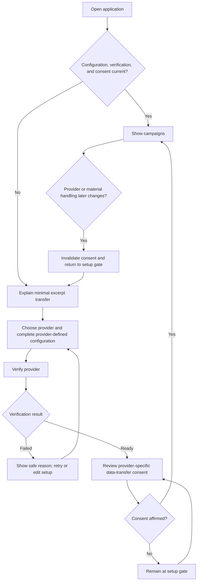
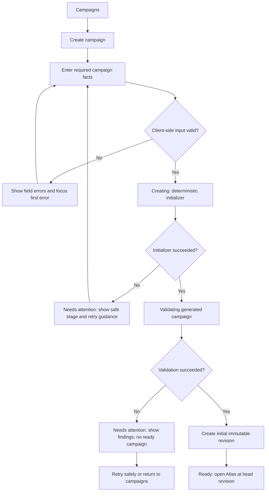
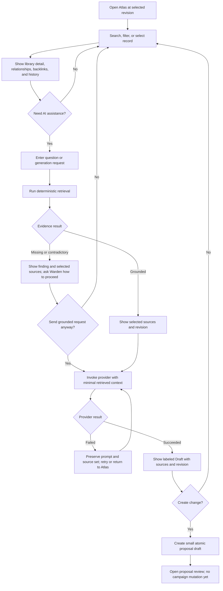
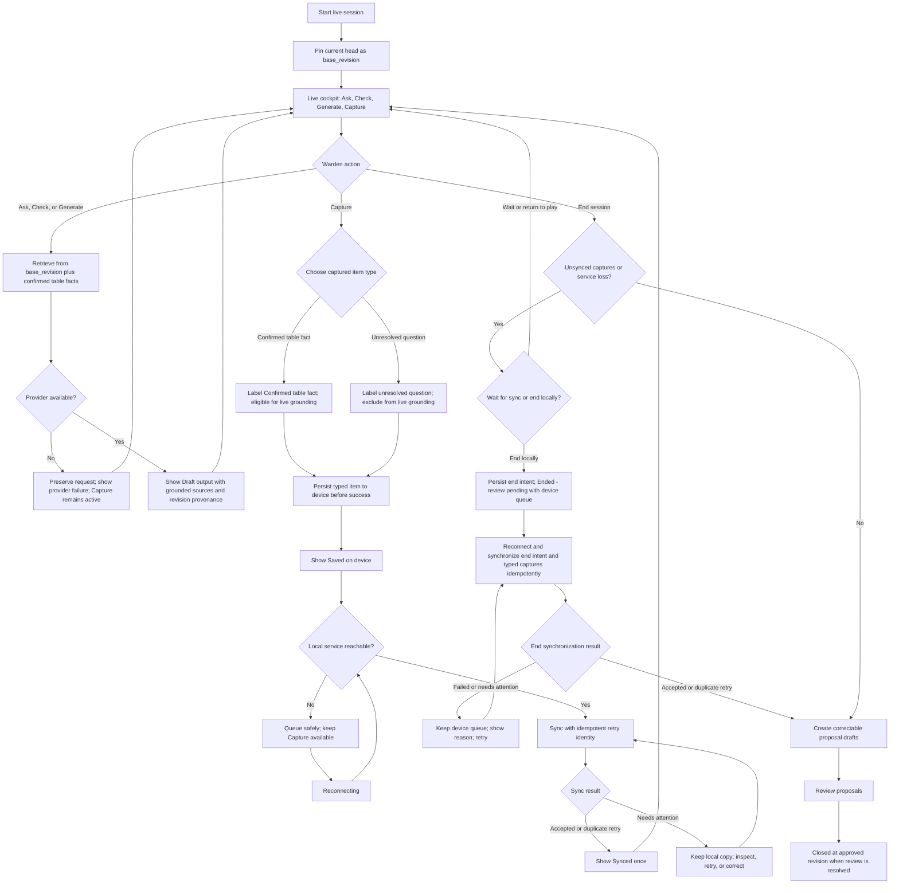
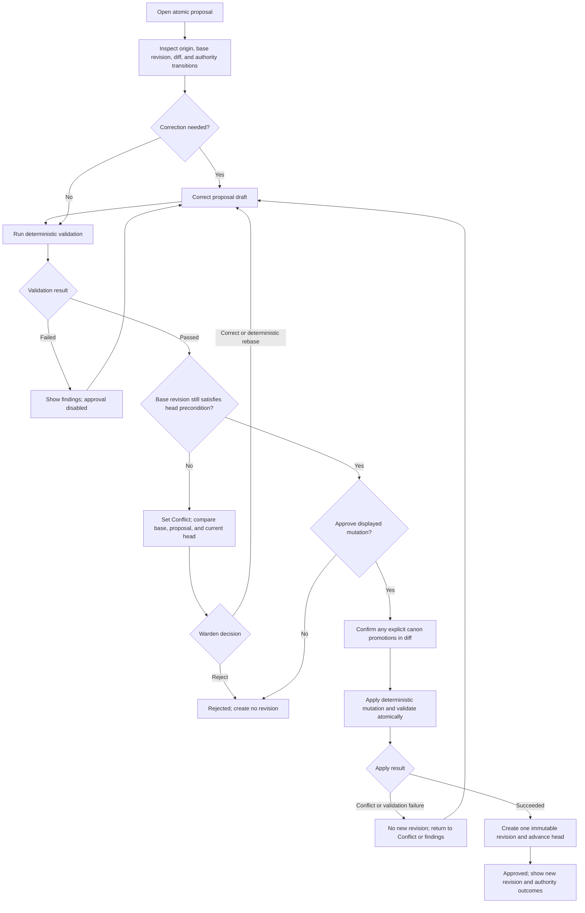

# Hosted MVP End-to-End Flows

Status: Phase 1 interaction specification. These flows define observable user
behavior and recovery, not API routes or persistence schemas.

## Flow conventions

- A boxed `Draft`, `Preparation`, `Confirmed table fact`, `Unresolved question`,
  `Proposal`, or `Canon` label is present whenever type or authority could be
  mistaken. An unresolved question is never grounding evidence.
- Revision references use a readable short label with a copy/reveal affordance
  for the full immutable identity.
- Error branches preserve entered work whenever doing so cannot imply a
  successful authoritative mutation.
- Provider-dependent generation and deterministic Drydock mutation are shown as
  separate stages.

## 1. Provider onboarding and consent



Behavior and recovery:

- Provider verification does not pre-check consent. Consent names the current
  provider/material-handling version and can be reviewed before affirmation.
- A failed verification never reveals credential values and does not unlock
  campaigns.
- If the service is unreachable during setup, the Warden sees that verification
  has not completed and can retry after service recovery.
- Removing configuration immediately gates workspace access. Existing campaign
  content remains untouched but is not exposed through an AI-enabled workspace
  without a ready provider and current consent.

## 2. Campaign creation



Recovery requirements:

- Retrying an interrupted request must resolve to one campaign or a clearly
  identified existing result, never a duplicate campaign created by ambiguity.
- A validation failure creates no usable head revision. Findings identify the
  affected input or deterministic stage without exposing repository internals
  as required user knowledge.
- Navigation away during creation requires an explicit safe consequence:
  cancel before mutation, or continue in background with a visible campaign-row
  state. Architecture decides which capability is supported; the frontend must
  not imply cancelability if the operation cannot be cancelled safely.

## 3. Atlas lookup, grounded retrieval, and generation



Atlas equivalents:

- Moving focus through graph nodes and activating a node selects the same record
  as the relationship list. The list exposes all visible edge types,
  directions, and backlinks in reading order.
- Timeline and history list share filters and entries. Approved history is
  loaded by default; Preparation and Proposal overlays require separate opt-in
  toggles and remain labeled non-canon.
- Loading or provider failure never removes the selected revision or existing
  Atlas data. Repeating the same retrieval at the same revision exposes the same
  source set before provider generation.

## 4. Live start, use, capture, recovery, and end



Live grounding and concurrency:

- If head advances in another tab, the cockpit announces the newer head but
  continues using the pinned `base_revision` plus confirmed table facts.
- The capture feed separates confirmed table facts from unresolved questions
  and identifies each item’s type plus whether it is only on device or also
  synced. Only confirmed table facts join live grounding. Unresolved questions
  and failed/invalid captures cannot silently join grounded retrieval.
- A duplicate sync response resolves the existing capture item by its stable
  identity; it never adds a second feed or timeline entry.
- Reload restores locally persisted captures and active-session context when
  supported. If the server says another tab owns a conflicting workflow state,
  preserve local unsent text, present the authoritative state, and require an
  explicit continue/refresh decision.
- Ending with a durable local queue must not claim the session is fully synced
  or that proposals already exist. The `Ended - review pending` view labels the
  end intent and each typed capture `Saved on device`, keeps the explicit
  unsynced queue and recovery available, and moves those same items through
  `Syncing` to `Synced` on reconnect. Proposal creation follows successful
  idempotent synchronization of the end intent and relevant confirmed facts;
  unresolved questions remain separately labeled review items.

## 5. Proposal correction, validation, approval, and conflict



Important semantics:

- Proposal approval authorizes only the displayed mutation. A change to canon
  is confirmed as an explicit authority transition in that diff.
- Closing a dialog, losing provider availability, or refreshing cannot approve
  a proposal.
- If head changes between final review and apply, the operation fails closed
  into `Conflict`; there is no silent merge, overwrite, or partial revision.
- Rejecting a proposal creates no revision. Corrections remain a proposal until
  validated and approved.

## 6. Two-tab and stale-read recovery

```mermaid
sequenceDiagram
    participant A as Tab A
    participant S as Authoritative service
    participant B as Tab B
    A->>S: Read head revision 12
    B->>S: Read head revision 12
    A->>S: Approve valid proposal against revision 12
    S-->>A: New head revision 13
    S-->>B: Head changed notification or stale response
    B->>S: Attempt approval against revision 12
    S-->>B: Conflict; current head revision 13
    Note right of B: Preserve unsent local text and show comparison
    B->>S: Submit corrected proposal against supported current base
```

For a read-only stale Atlas view, the Warden may continue reading revision 12 or
go to head. For mutation, stale context must be named and blocked until the
Warden chooses a supported correction path.

## Flow-level data and capability needs

| Flow | User-visible capability/data required | Architecture question retained |
| --- | --- | --- |
| Setup | Provider-defined configuration requirements, configuration-present state, verification outcome, consent requirement/currentness, material-change reason | Credential/configuration storage and consent record contract |
| Creation | Deterministic stage, validation findings, retry result, initial revision | Cancellation and idempotent creation mechanics |
| Atlas | Revision-scoped indexes, typed edges/backlinks, approved history and labeled overlays | Projection/query implementation |
| Retrieval | Stable pre-generation sources, evidence findings, revision provenance, provider progress/error | Provider orchestration and transport |
| Live | Stable session and base revision, ordered typed captures, grounding eligibility limited to confirmed facts, head-change signal | Active-session concurrency contract |
| Offline capture and end | Durable device-local typed captures and end intent, separate sync state, retry identity, duplicate acceptance result | Device/server persistence and reconciliation contract |
| Proposal | Atomic diff, authority transitions, validation, base/head comparison, outcome | Mutation/concurrency transaction contract |
| Revisions | Immutable identity, head marker, validated approval provenance, read-only comparison | Snapshot persistence and projection rebuild |

No row specifies an endpoint, payload, database table, or provider SDK.
