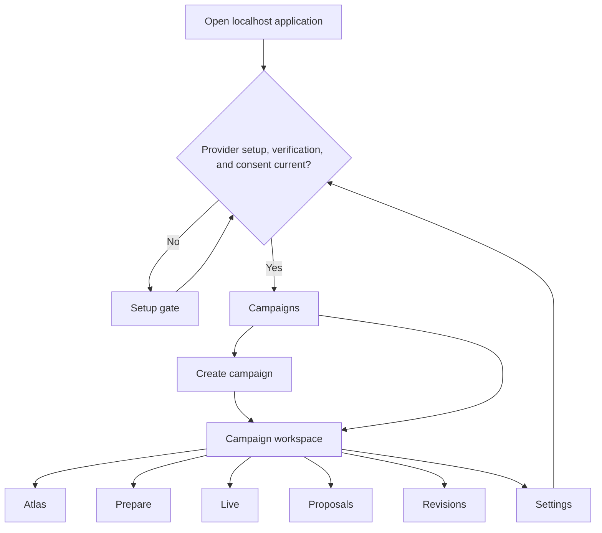

# Hosted MVP Information Architecture

Status: Phase 1 interaction specification for the localhost personal pilot.
Authority: `docs/product-decisions.md` and
`docs/hosted-mvp-product-brief.md` take precedence over this design.

## Experience model

The pilot serves one Warden on one computer. It has three nested contexts:

1. **Setup gate** — provider configuration, verification, and data-transfer
   consent. Campaign content is inaccessible until all three are current.
2. **Campaign home** — create a campaign or select an existing campaign created
   by the pilot.
3. **Campaign workspace** — inspect authority, prepare, run play, and review
   deterministic changes against an immutable revision.

The workspace always answers four questions without requiring navigation:

- Which campaign and revision am I viewing?
- Is the content canon, preparation, a confirmed table fact, an unresolved
  question, an AI draft, or a proposal?
- Is local work saved, syncing, synced, or in need of attention?
- Is the provider and local service available for this action?

AI language must use **Draft**. Mutation language must use **Proposal** and
must name its `base_revision`. The UI must never use “saved” alone when it only
means durable device-local persistence, and must never use “approved” as a
synonym for “promoted to canon.”

## Top-level map

## Global shell

### Setup and campaign levels

- Product identity and local-only context.
- Provider status: `Setup required`, `Verifying`, `Ready`, or `Failed`.
- Service/connectivity status using text plus icon, never color alone.
- Settings entry. Removing or materially changing provider configuration sends
  the user back to the setup gate until verification and renewed consent.
- No registration, player, collaboration, import, export, or sync-to-Git entry.

### Campaign workspace level

The persistent frame contains:

- Campaign switcher and campaign name.
- Primary navigation: `Atlas`, `Prepare`, `Live`, `Proposals`, `Revisions`.
- A continuously visible authority strip with:
  - viewed revision and head revision;
  - live `base_revision` when a session is active or awaiting review;
  - current content authority;
  - local save/sync state when unsynced live captures or an offline end intent
    exist;
  - provider/service availability;
  - an explicit stale or conflict warning when applicable.
- Settings entry scoped into `Campaign` and `Provider & data transfer`.

On narrow viewports, primary navigation becomes a labeled bottom navigation or
an equivalently persistent menu. The authority strip condenses to one status
summary button such as `Rev 12 · Canon · Synced`; activating it exposes every
field as text. Critical states (`Offline`, `Needs attention`, `Conflict`) remain
visible beside that summary and are never hidden in the menu.

## Section architecture

### 1. Setup gate

Purpose: establish the minimum valid AI configuration before any campaign
workspace can be opened.

Ordered sections:

1. **What leaves this computer** — plain-language explanation that only minimal
   excerpts selected by deterministic retrieval are sent to the configured
   provider; link to details.
2. **Provider** — supported provider choice and provider-defined credential or
   configuration fields. The exact provider list, field requirements, and
   credential storage are architecture inputs, not design decisions.
3. **Verify connection** — explicit test with `Verifying`, `Ready`, and `Failed`
   outcomes. Failure preserves entered non-secret choices and provides retry and
   edit actions without exposing credential values.
4. **Data-transfer consent** — unchecked explicit consent, with provider and
   material-handling version identified. Consent is not bundled into provider
   verification.
5. **Continue to campaigns** — enabled only when configuration, successful
   verification, and current consent are all present.

Changing the provider or a material handling notice invalidates prior consent.
The gate states what changed and requires a fresh affirmative action.

### 2. Campaigns and creation

**Campaigns** is a local list of campaigns created in the application. Each
row/card shows name, Mothership adapter, head revision, last local activity,
and any `Needs attention` state. The empty state explains creation and offers
one primary action: `Create campaign`.

**Create campaign** is a short browser form containing only campaign facts
required by the deterministic initializer. The UI must not expose filesystem,
Git, Python, package, adapter internals, import, or export controls. Mothership
is presented as the pilot’s supported system, not as a selectable multi-system
framework.

Creation progress is an ordered status view:

`Creating` → `Validating` → `Ready`, or `Needs attention` with the failed stage,
human-readable validation findings, retry rules, and a safe return to the
campaign list. The campaign opens only after the initial immutable revision
validates.

### 3. Campaign Atlas

Atlas is the campaign understanding surface, organized around one selected
source revision.

- **Library** — deterministic search, record type and authority filters, result
  count, record list, selected record detail, backlinks, and source revision.
- **Relationships** — bounded, typed neighborhood for the selected record.
  `Graph` and `Relationship list` are equal modes over the same data; the list
  is not a reduced fallback. Both include direction, relationship type, target,
  and navigation to the related record.
- **History** — approved-history timeline by default. Optional `Preparation`
  and `Proposals` overlays are separate unchecked toggles, labeled non-canon,
  and do not alter the approved-history result count. `Timeline` and `History
  list` are equivalent modes with the same entries, ordering, filters, and
  source links.

Every record detail identifies authority and the revision where the displayed
version came from. Empty relationships and empty history use explicit text
rather than a blank visualization.

### 4. Prepare and AI

Prepare has a task prompt, deterministic source preview, AI draft output, and
proposal action.

1. The Warden asks, checks, or requests generation.
2. Retrieval completes before provider invocation and shows selected supporting
   records and revision.
3. The provider response is labeled `Draft` and keeps its sources reachable.
4. Missing or contradictory evidence is shown as a finding, not filled by the
   model.
5. `Create proposal` opens an atomic change draft; it does not mutate campaign
   content.

The source preview remains inspectable after generation. Provider failure
preserves the prompt and retrieved source set so the Warden can retry the same
grounded request or continue inspecting Atlas.

### 5. Live cockpit

The live session header shows `Live at revision <base_revision>` and, if
different, `Campaign head is now <head_revision>; live grounding is unchanged`.
The four primary modes are:

- **Ask** — produce a provider `Draft` answer with source and revision
  provenance.
- **Check** — produce a provider `Draft` assessment against canon and confirmed
  table facts, with source and revision provenance.
- **Generate** — create disposable inspiration, always labeled `Draft`.
- **Capture** — choose and visibly label one of two distinct workflow types:
  `Confirmed table fact` or `Unresolved question`. Both persist locally first,
  but only confirmed table facts are eligible for live grounding.

Every Ask, Check, or Generate provider output retains the authority label
`Draft`; grounded sources and revision are provenance, never authority. The main
region prioritizes the current response/capture. A persistent session rail or
sheet separates `Confirmed table facts` from `Unresolved questions`. Every item
shows its type/authority label plus `Saved on device`, `Syncing`, `Synced`, or
`Needs attention`. Unresolved questions are explicitly excluded from live
grounding. Provider failure disables only provider-dependent Ask, Check, and
Generate submission; Capture remains available. Service loss/offline mode
preserves Capture through durable device-local persistence and explains that
local persistence is not server sync.

`End session` is persistent but visually separated from frequent actions. It
first reports unsynced captures. With service available, it closes active
capture and creates small correctable proposals for review. If service is
unavailable, the device durably records the end intent and shows `Ended - review
pending` plus the unsynced queue; proposal creation waits for synchronization
instead of pretending that a server revision exists. The session remains
`Ended - review pending` until its proposals are resolved, then becomes `Closed
at revision ...`.

### 6. Proposals and revisions

**Proposals** defaults to `Needs review`, with filters for `Draft`, `Conflict`,
`Approved`, and `Rejected`. Each small atomic proposal displays:

- base and current head revisions;
- originating AI draft, live session, or Warden action;
- deterministic diff and validation result;
- authority changes per affected record, including explicit canon promotion;
- actions to correct, validate, approve, or reject.

Approval is disabled until validation succeeds and the base revision matches
the required concurrency precondition. A stale proposal becomes `Conflict`;
the Warden can inspect newer head changes, revise/rebase through the supported
deterministic operation, or reject. There is no one-click silent merge.

**Revisions** lists immutable snapshots, identifies head, shows validation and
approval provenance, and opens a read-only diff/detail. Selecting an older
revision changes the Atlas viewing context but does not move head. No export or
Git-history actions appear.

### 7. Settings

- **Provider & data transfer** — provider status, provider-defined
  credential/configuration management, consent scope/version/time,
  data-handling explanation, reverify, and remove configuration. Provider or
  material-handling changes invalidate consent and return to the setup gate.
- **Campaign** — campaign identity and supported non-destructive preferences.
- **Accessibility** — persistent visualization preference (`Graph` or
  `Relationship list`; `Timeline` or `History list`) and reduced-motion
  preference where available.

Settings must not expose credential values after entry or imply that
workflow/audit data is campaign canon.

## Complete state inventory

| State | Visible meaning | Available recovery | Protected behavior |
| --- | --- | --- | --- |
| Empty campaigns | No campaigns created in this pilot | Create campaign | No import affordance |
| Empty Atlas result | No records match this revision and filter | Clear individual or all filters | Retain revision context |
| Empty relationships/history | Selected record has no matching entries | Return to library; enable optional overlay explicitly | Never fabricate links/events |
| Loading | Named operation and retained context | Cancel when safe; continue navigation when read-only | Do not replace known revision/status with a spinner |
| General failure | Failed operation, safe persisted state, technical reference if available | Retry or return to last safe view | No implied mutation |
| Provider failure | Provider unavailable or rejected request | Retry same grounded request; edit provider settings | Preserve prompt and retrieved sources; Capture stays usable |
| Validation failure | Deterministic findings with affected records | Correct proposal/input and revalidate | No revision created; approval disabled |
| Offline/service unavailable | Device cannot reach local service | Continue local Capture; retry reads/actions when reconnected | Label `Saved on device`, never `Synced` |
| Offline-ended session | End intent and typed captured items are durable only on this device | Show `Ended - review pending`, the explicit typed unsynced queue, and reconnect/retry status | No proposal, canon change, server sync, or revision is claimed before idempotent synchronization |
| Reconnecting | Service reachable check or sync is in progress | Allow local Capture; show queue and retry progress | Do not submit duplicate mutations |
| Duplicate retry | A typed capture retry identity was already accepted | Show the original item in its correct typed list and current sync state | Exactly one captured item; no duplicate fact, question, or timeline item |
| Stale viewed revision | User is viewing a revision older than head | Go to head or continue read-only | No edit against ambiguous base |
| Stale proposal | Proposal base no longer meets head precondition | Inspect head changes; deterministic correction/rebase; reject | No silent overwrite or approval |
| Two-tab conflict | Another tab advanced head or changed active workflow state | Refresh authoritative state; preserve local unsent text; choose which tab continues live control | No last-write-wins mutation |
| Proposal conflict | Proposed changes conflict with newer authoritative content | Compare base, proposal, and head; correct and revalidate; reject | Remains `Conflict`; no revision created |
| Needs attention capture | Local capture cannot sync automatically | Inspect error; retry; copy text; correct only if invalid | Keep durable local copy until acknowledged resolution |
| Consent expired | Provider or material handling changed | Review change and consent again | Workspace remains gated |

All banners and rows must include a textual state label, a concise consequence,
and the next safe action. Status icons are supplementary.

## Data and capability needs for architecture and frontend

These are interaction requirements, not endpoint or schema designs.

- Setup gate needs the supported provider choices and provider-defined
  configuration-field metadata; verification state and safe failure reason;
  whether configuration exists without returning credential values; the
  provider/material-handling identifier requiring consent; and whether current
  consent matches it.
- Campaign list needs locally available campaign identity, supported system,
  head revision, last activity, and attention state.
- Creation needs deterministic progress stages, validation findings, retry
  safety, and the initial validated revision identity.
- The global authority strip needs viewed revision, head revision, live
  `base_revision`, authority label, provider/service availability, and aggregate
  local sync state.
- Atlas needs deterministic record counts and filters, record summaries and
  details, typed directional relationships and backlinks, approved history,
  opt-in preparation/proposal overlays, and revision provenance for every item.
- Provider assistance needs the stable retrieved source set before generation,
  source identifiers safe to display, source revision,
  contradiction/missing-evidence findings, provider progress/failure, a
  persistent `Draft` authority label, and a preserved draft association.
- Live needs a stable session identity and `base_revision`; ordered captured
  items with explicit `Confirmed table fact` or `Unresolved question` type;
  grounding eligibility limited to confirmed table facts; a durable
  device-local end intent; separate device-persistence and server-sync state for
  captured items and end intent; idempotent retry identity; and head-change
  notification without changing live grounding.
- Proposal review needs atomic diff data, base and current head identities,
  validation results, explicit per-change authority transitions, conflict
  details, origin, and final outcome.
- Revisions need immutable identity, head marker, validation/approval metadata,
  parent or comparison context, and read-only diff material.
- Concurrent tabs need an authoritative change notification or refresh signal
  and enough state to preserve unsent local input while refusing stale writes.
- Accessibility needs stable labels/relationships shared by visual and text
  representations, focus targets after updates, and status announcements that
  do not depend on color.

Provider credential/configuration storage, consent persistence, device-local
persistence mechanism, concurrency mechanics, API shapes, database schema, and
transport choice remain Architect decisions.
